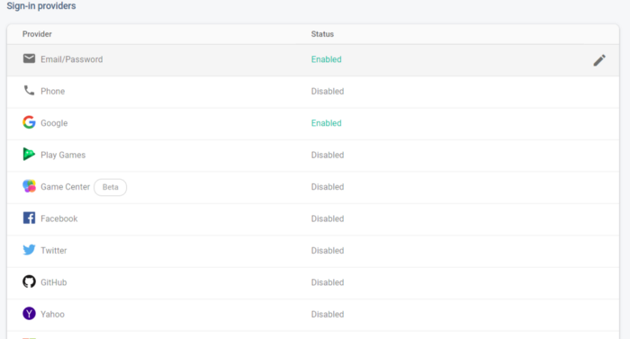
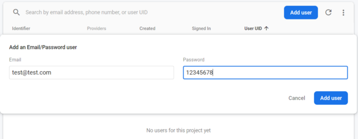
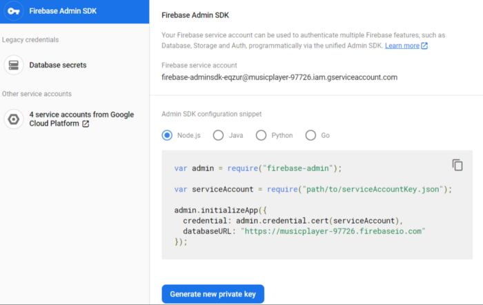
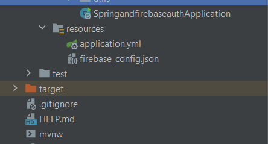

# Firebase And Spring Boot

This repository is an example of how to use Firebase with Springboot to provide authentication services.

## Configuring Firebase

Before we start enable the SignIn Methods. I enable Email/Password and Google and create a user. You can simply add a user using email/password.




### Configuring Firebase in the SpringBoot Project:

To configure the firebase in the spring boot project first download the google-services.json file from your Firebase Project setting.

Go to Project Setting -> Service Account-> Scroll down and click on create and then click on Generate new Private Key

This will generate and download Private Key to access the Firebase Admin SDK

The code snippets are also provided for different language



Now rename the private key to firebase_config.json and paste in the resource folder of your spring boot project. This is the location where we access our private key. You can also store on other location or environment variable. For this tutorial, we will store in the resource folder



## Configuring POM.xml

These files are already in place but lets point them out

```
<dependency>
	<groupId>com.google.firebase</groupId>
	<artifactId>firebase-admin</artifactId>
	<version>8.1.0</version>
</dependency>
<dependency>
	<groupId>org.springframework.boot</groupId>
	<artifactId>spring-boot-starter-security</artifactId>
</dependency>
```

## Configuring SpringBoot Project to add Security

We created a filter to check every request for the JWT bearer token in the request.

For this, we are made a **OncePerRequestFilter**. **Filter** base class that aims to guarantee a **single** execution **per request** dispatch.


```
@Component
public class SecurityFilter extends OncePerRequestFilter {
...

    @Override
    protected void doFilterInternal(HttpServletRequest request, HttpServletResponse response, FilterChain filterChain)
            throws ServletException, IOException {
        verifyToken(request);
        filterChain.doFilter(request, response);
    }

    private void verifyToken(HttpServletRequest request) {
        String session = null;
        FirebaseToken decodedToken = null;
        CredentialType type = null;
        boolean strictServerSessionEnabled = securityProps.getFirebaseProps().isEnableStrictServerSession();
        Cookie sessionCookie = cookieUtils.getCookie("session");
        String token = securityService.getBearerToken(request);
        try {
            if (sessionCookie != null) {
                session = sessionCookie.getValue();
                decodedToken = FirebaseAuth.getInstance().verifySessionCookie(session,
                        securityProps.getFirebaseProps().isEnableCheckSessionRevoked());
                type = CredentialType.SESSION;
            } else if (!strictServerSessionEnabled) {
                if (token != null && !token.equalsIgnoreCase("undefined")) {
                    decodedToken = FirebaseAuth.getInstance().verifyIdToken(token);
                    type = CredentialType.ID_TOKEN;
                }
            }
        } catch (FirebaseAuthException e) {
            e.printStackTrace();
            logger.error("Firebase Exception:: ", e.getLocalizedMessage());
        }
        FireBaseUser user = firebaseTokenToUserDto(decodedToken);
        if (user != null) {
            UsernamePasswordAuthenticationToken authentication = new UsernamePasswordAuthenticationToken(user,
                    new Credentials(type, decodedToken, token, session), null);
            authentication.setDetails(new WebAuthenticationDetailsSource().buildDetails(request));
            SecurityContextHolder.getContext().setAuthentication(authentication);
        }
    }

...


}
```

In this filter, we are first checking is session-based authentication if the session cookie is available then we are verifying the session cookie and fetching the details, and set to SecurityContextHolder. If the session cookie is not available then we are using Bearer token.


```
@Service
public class SecurityService {

...

    public User getUser() {
        User userPrincipal = null;
        SecurityContext securityContext = SecurityContextHolder.getContext();
        Object principal = securityContext.getAuthentication().getPrincipal();
        if (principal instanceof User) {
            userPrincipal = ((User) principal);
        }
        return userPrincipal;
    }

    public Credentials getCredentials() {
        SecurityContext securityContext = SecurityContextHolder.getContext();
        return (Credentials) securityContext.getAuthentication().getCredentials();
    }

    public boolean isPublic() {
        return securityProps.getAllowedPublicApis().contains(httpServletRequest.getRequestURI());
    }

    public String getBearerToken(HttpServletRequest request) {
        String bearerToken = null;
        String authorization = request.getHeader("Authorization");
        if (StringUtils.hasText(authorization) && authorization.startsWith("Bearer ")) {
            bearerToken = authorization.substring(7);
        }
        return bearerToken;
    }
}
```

SecurityService to decode Bearer token from a request and fetching Principle from SecurityContextHolder.

```
@Configuration
public class SecurityConfig{

    private ObjectMapper objectMapper;
    private SecurityProperties restSecProps;
    public SecurityFilter tokenAuthenticationFilter;

    @Autowired
    public SecurityConfig(ObjectMapper objectMapper, SecurityProperties restSecProps, SecurityFilter tokenAuthenticationFilter){
        this.objectMapper = objectMapper;
        this.restSecProps = restSecProps;
        this.tokenAuthenticationFilter = tokenAuthenticationFilter;
    }


    @Bean
    public AuthenticationEntryPoint restAuthenticationEntryPoint() {
        return (httpServletRequest, httpServletResponse, e) -> {
            Map<String, Object> errorObject = new HashMap<>();
            int errorCode = 401;
            errorObject.put("message", "Unauthorized access of protected resource, invalid credentials");
            errorObject.put("error", HttpStatus.UNAUTHORIZED);
            errorObject.put("code", errorCode);
            errorObject.put("timestamp", new Timestamp(new Date().getTime()));
            httpServletResponse.setContentType("application/json;charset=UTF-8");
            httpServletResponse.setStatus(errorCode);
            httpServletResponse.getWriter().write(objectMapper.writeValueAsString(errorObject));
        };
    }

    @Bean
    public CorsConfigurationSource corsConfigurationSource() {
        CorsConfiguration configuration = new CorsConfiguration();
        configuration.setAllowedOrigins(restSecProps.getAllowedOrigins());
        configuration.setAllowedMethods(restSecProps.getAllowedMethods());
        configuration.setAllowedHeaders(restSecProps.getAllowedHeaders());
        configuration.setAllowCredentials(restSecProps.isAllowCredentials());
        configuration.setExposedHeaders(restSecProps.getExposedHeaders());
        UrlBasedCorsConfigurationSource source = new UrlBasedCorsConfigurationSource();
        source.registerCorsConfiguration("/**", configuration);
        return source;
    }

    @Bean
    public SecurityFilterChain configure(HttpSecurity http) throws Exception {
        http.cors().configurationSource(corsConfigurationSource()).and().csrf().disable().formLogin().disable()
                .httpBasic().disable().exceptionHandling().authenticationEntryPoint(restAuthenticationEntryPoint())
                .and().authorizeRequests()
                .antMatchers(restSecProps.getAllowedPublicApis().toArray(String[]::new)).permitAll()
                .antMatchers(HttpMethod.OPTIONS, "/**").permitAll().anyRequest().authenticated().and()
                .addFilterBefore(tokenAuthenticationFilter, UsernamePasswordAuthenticationFilter.class)
                .sessionManagement().sessionCreationPolicy(SessionCreationPolicy.STATELESS);
        return http.build();
    }

    @Bean
    public WebSecurityCustomizer webSecurityCustomizer() {
        return (web) -> web.ignoring().antMatchers("/images/**", "/js/**", "/webjars/**");
    }
}

```

Spring Security WebSecurityConfigurerAdapter to configure Cors, SecurityFilter, and AuthenticationEntryPoint for changing the default HTML Unauthorised page to API based 401 response.

```
security:
...
  allowed-origins:
    - https://${DOMAIN}
    - http://localhost:3000
  allowed-methods:
    - GET
    - POST
    - PUT
    - PATCH
    - DELETE
    - OPTIONS
  allowed-headers:
    - Authorization
    - Origin
    - Content-Type
    - Accept
    - Accept-Encoding
    - Accept-Language
    - Access-Control-Allow-Origin
    - Access-Control-Allow-Headers
    - Access-Control-Request-Method
    - X-Requested-With
    - X-Auth-Token
    - X-Xsrf-Token
    - Cache-Control
    - Id-Token
  allowed-public-apis:
    - /favicon.ico
    - /session/login
    - /public/**
  exposed-headers:
    - X-Xsrf-Token
```

**application.yml** file to change the properties of headers, public domains, etc

To get a token use this url:

```
https://www.googleapis.com/identitytoolkit/v3/relyingparty/verifyPassword?key={webapikey}
```

with body:

```
{
    "email":"test@test.com",
    "password":"12345678",
    "returnSecureToken":true
}
```